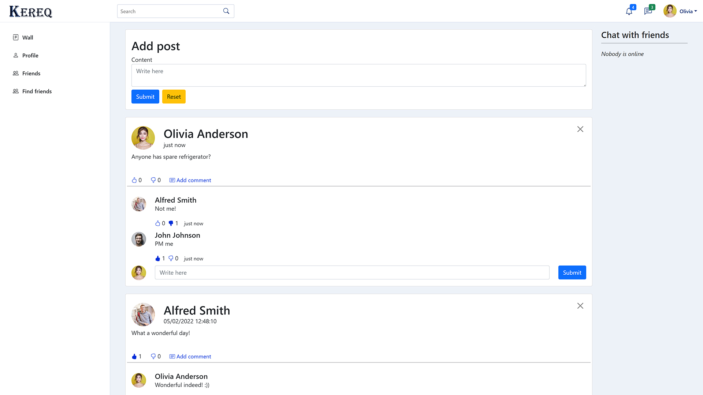
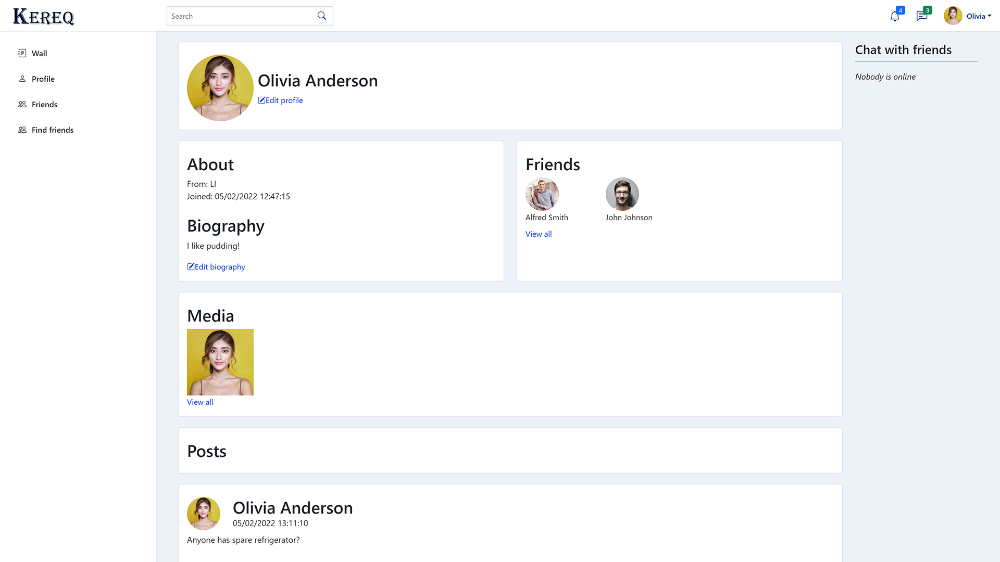
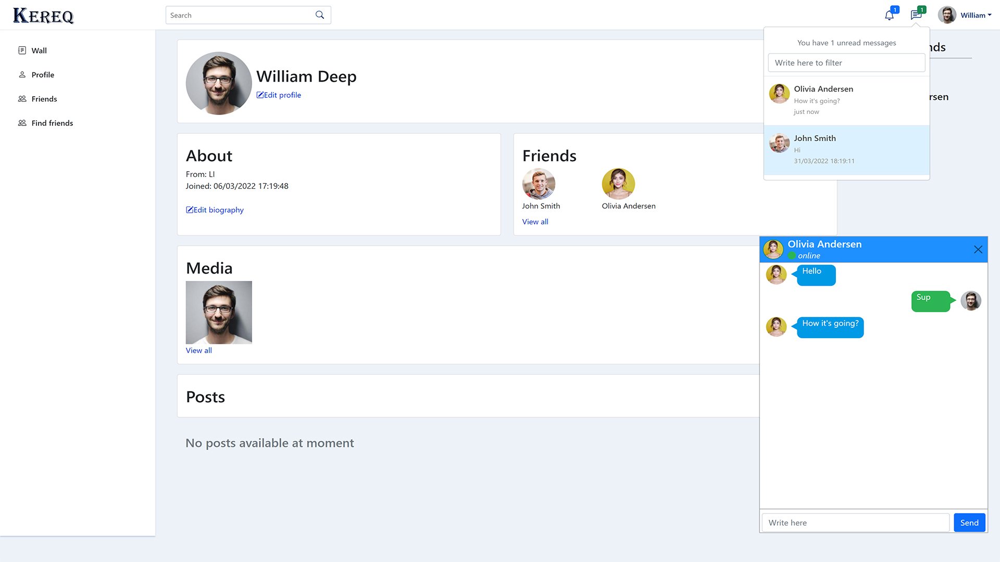

# Kereq
Collective repository for social media platform named Kereq.

## Table of Contents
* [General Info](#general-information)
* [Tech Stack](#tech-stack)
* [Current functionalities](#current-functionalities)
* [Screenshots](#screenshots)
* [Project Status](#project-status)

## General Information
Kereq is social media platform, where users can share information about them and create virtual communities.
This project's purpose is fully educational. Reasons why I chose this type of project:
- It is challenging
- It has a lot of potential feature/technologies to use
- It is fun

## Tech Stack
- Java 11
- Spring Boot 2.5.5
- Spring Cloud
- PostgreSQL
- MongoDB
- RabbitMQ
- Ehcache
- AspectJ

## Current functionalities
- Creating an account and logging in
- Posting/commenting
- Liking/disliking posts and comments
- Posts and comments statistics (comments, likes and dislikes count)
- Profile pictures (currently upload only)
- Find-friends posters (advertise yourself to find friends, target age range and gender can be choosen)
- Friends system (invitations, friend management)
- Chat bar showing online friends
- Chat with history and unread messages notification
- Notifications (basic mechanism)

## Screenshots

## Project Status
In progress: early alpha.
